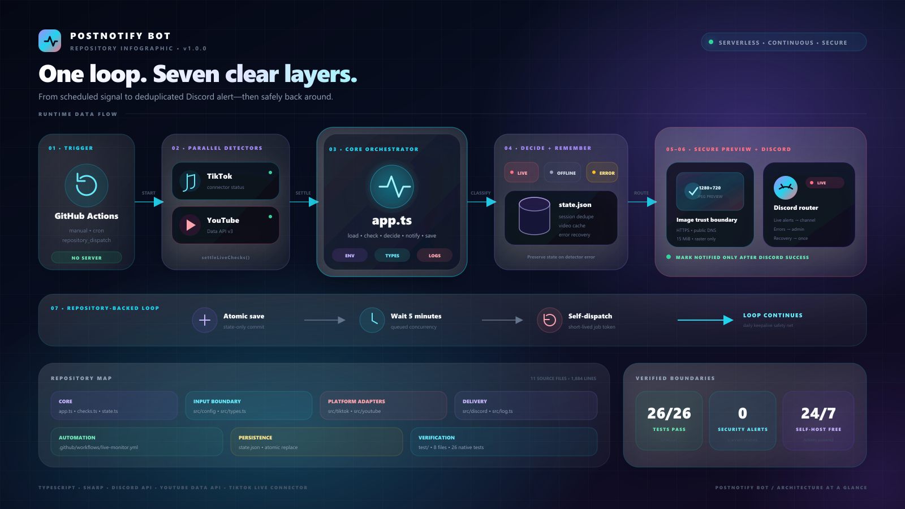

# postnotify_bot

Automated Discord notification bot that sends rich alerts when TikTok creators or YouTube channels go live. Runs continuously through a **GitHub Actions self-triggering loop**—no dedicated server required.

## Architecture at a Glance



The runtime forms one repository-backed loop: GitHub Actions triggers parallel detectors, [`app.ts`](src/app.ts) classifies results and deduplicates sessions through [`state.ts`](src/state.ts), [`src/discord`](src/discord) builds secure previews and routes notifications, then the workflow atomically syncs state and dispatches the next cycle.

---

## Features

- 🔴 Automatic TikTok and YouTube live detection (~5-minute polling interval)
- ▶️ Official YouTube Data API v3 detection through each channel's uploads playlist
- 🧭 Separate Discord channel and mention routing for YouTube alerts
- 🖼️ Platform-aware 1280×720 preview image with blurred background, avatar, title, and statistics
- 🌏 Multilingual preview text covering Latin, Cyrillic, Greek, CJK, Korean, Arabic, Hebrew, Indic, and Thai titles
- 📨 Discord rich embeds with viewer count, start time, platform, and action buttons
- 🔕 Platform-prefixed session deduplication prevents repeated notifications for one broadcast
- 🩺 Deduplicated admin error alerts and one-time recovery notifications
- ⚡ Persistent active-video cache reduces YouTube API quota usage while a stream remains live
- 🔒 Workflow concurrency queues overlapping triggers without cancelling state-bearing runs
- 💾 Corruption-safe, atomically written notification state through repository-backed `state.json`
- 🧪 Dependency-free native regression suite for state, APIs, orchestration, Discord, previews, and security boundaries
- 📦 Immutable Action/runtime pins and lockfile-enforced dependency installation
- 🌐 HTTPS-only remote images with public-network, redirect, byte, MIME, format, and pixel validation
- 🔑 Short-lived GitHub job token powers state sync and self-dispatch; no personal access token required
- 🔄 Daily keepalive protects scheduled workflows from GitHub's 60-day inactivity disablement
- ♾️ Self-triggering loop runs without an external scheduler or server

---

## How It Works

```text
[manual dispatch or daily cron at 00:00 UTC]
        ↓
[Check configured TikTok usernames and YouTube channel IDs in parallel]
        ↓
[Classify each result as live, offline, or operational error]
        ↓
[Preserve target state on error; deduplicate admin error and recovery alerts]
        ↓
[Prune confirmed-offline targets and cache active YouTube video IDs]
        ↓
[Ignore session if platform:creator:broadcast ID already exists in state]
        ↓
[Generate platform-aware 1280×720 JPEG preview with Sharp]
        ↓
[Route TikTok or YouTube embed to its configured Discord channel]
        ↓
[Atomically save state.json; rebase and retry its state-only commit]
        ↓
[sleep 300 seconds]
        ↓
[repository_dispatch uses the short-lived GitHub job token]
        ↓
[Loop continues]
```

---

## Setup Guide

### Step 1 — Fork This Repository

Fork to your own GitHub account so you can add Secrets and run Actions.

```bash
git clone https://github.com/YOUR_USERNAME/postnotify_bot
cd postnotify_bot
```

### Step 2 — Create a Discord Bot

1. Open the [Discord Developer Portal](https://discord.com/developers/applications)
2. Create a new application → **Bot** → copy the **Bot Token**
3. Invite the bot to your server with permissions: **Send Messages** + **Embed Links** + **Attach Files**
4. Copy the **Channel ID** of the target notification channel (right-click channel → Copy Channel ID)

### Step 3 — Get a YouTube Data API v3 Key

Required only when YouTube monitoring is enabled.

1. Open the [Google Cloud Console](https://console.cloud.google.com/)
2. Select an existing project or click **New Project**, enter a project name, then create it
3. Open [APIs & Services → Library](https://console.cloud.google.com/apis/library)
4. Search for **YouTube Data API v3**, open it, then click **Enable**
5. Open [APIs & Services → Credentials](https://console.cloud.google.com/apis/credentials)
6. Click **Create Credentials → API key**
7. Under **Application restrictions**, select **None** because GitHub-hosted runner IP addresses are dynamic
8. Under **API restrictions**, select **Restrict key**, choose **YouTube Data API v3**, then click **Create**
9. Copy the generated key; this value becomes the `YOUTUBE_API_KEY` GitHub Secret

> [!IMPORTANT]
> Never commit the API key to the repository or place it directly in the workflow file. Store it only as the `YOUTUBE_API_KEY` GitHub Secret.

> [!NOTE]
> New Google Cloud projects normally receive 10,000 YouTube Data API quota units per day. This bot limits YouTube monitoring to 10 channels to stay within that default quota under normal polling.

### Step 4 — Configure GitHub Secrets

Go to your repository → **Settings → Secrets and variables → Actions → New repository secret**

| Secret | Required | Description |
|--------|:--------:|-------------|
| `DISCORD_BOT_TOKEN` | ✅ | Shared Discord bot token from Step 2 |
| `TIKTOK_USERNAMES` | ❌ | Comma-separated TikTok usernames without `@`; enables TikTok monitoring |
| `TIKTOK_DISCORD_CHANNEL_ID` | Conditional | Required when `TIKTOK_USERNAMES` is set |
| `TIKTOK_DISCORD_MENTION` | ❌ | Optional ping for TikTok alerts |
| `YOUTUBE_CHANNEL_IDS` | ❌ | Comma-separated immutable `UC...` channel IDs; maximum 10 |
| `YOUTUBE_API_KEY` | Conditional | Required when `YOUTUBE_CHANNEL_IDS` is set; YouTube Data API v3 key |
| `YOUTUBE_DISCORD_CHANNEL_ID` | Conditional | Required when `YOUTUBE_CHANNEL_IDS` is set |
| `YOUTUBE_DISCORD_MENTION` | ❌ | Optional ping for YouTube alerts |
| `ADMIN_DISCORD_CHANNEL_ID` | Conditional | Required whenever TikTok or YouTube monitoring is configured |
| `ADMIN_DISCORD_MENTION` | ❌ | Optional ping for new operational errors and recovery alerts |

**Creator examples:**

```text
TIKTOK_USERNAMES=streamer1,streamer2,streamer3
YOUTUBE_CHANNEL_IDS=UCxxxxxxxxxxxxxxxxxxxxxx,UCyyyyyyyyyyyyyyyyyyyyyy
```

At least one complete platform pair is required. Supported modes:

```text
TikTok only:  TIKTOK_USERNAMES + TIKTOK_DISCORD_CHANNEL_ID
YouTube only: YOUTUBE_CHANNEL_IDS + YOUTUBE_DISCORD_CHANNEL_ID
Both:         configure both pairs
```

YouTube-only example:

```text
DISCORD_BOT_TOKEN=your_bot_token
YOUTUBE_CHANNEL_IDS=UCxxxxxxxxxxxxxxxxxxxxxx
YOUTUBE_API_KEY=your_google_api_key
YOUTUBE_DISCORD_CHANNEL_ID=123456789012345678
YOUTUBE_DISCORD_MENTION=<@&123456789012345678>
ADMIN_DISCORD_CHANNEL_ID=123456789012345679
ADMIN_DISCORD_MENTION=<@&123456789012345678>
```

For YouTube-only mode, leave `TIKTOK_USERNAMES`, `TIKTOK_DISCORD_CHANNEL_ID`, and `TIKTOK_DISCORD_MENTION` unset.

Find a YouTube channel ID in the channel page source, an About-page URL, or through a channel ID lookup. Use the immutable `UC...` ID, not a handle such as `@creator`.


**Mention examples:**

| Value | Effect |
|-------|--------|
| `@everyone` | Pings everyone |
| `@here` | Pings online members |
| `<@&ROLE_ID>` | Pings a specific role |
| `<@USER_ID>` | Pings a specific user |

Leave either mention secret unset to send that platform's notification without a ping.

### Step 5 — Enable GitHub Actions

1. Go to the **Actions** tab in your repository
2. Click **"I understand my workflows, go ahead and enable them"** if prompted
3. Select **PostNotify Live Monitor** → click **Run workflow** to start the loop

The workflow declares its required permissions per job, so the repository-wide default can remain **Read repository contents and packages permissions**. The loop runs automatically afterward with GitHub's short-lived job token; no PAT is required. A daily cron at `00:00 UTC` acts as a safety net to restart the loop if it ever dies.

---

## Stopping the Loop

1. Disable the workflow from **Actions → PostNotify Live Monitor → … → Disable workflow**, or remove its `repository_dispatch` trigger.
2. Cancel any currently running or queued monitor run.

Cancelling one run alone is temporary: the daily cron can restart the workflow.

---

TikTok alert:

```text
🔴 @streamer123 sedang LIVE di TikTok!
TikTok LIVE • @streamer123
📱 Platform: TikTok Live
[📺 Tonton Live] [👤 Lihat Profil]
```

YouTube alert:

```text
🔴 Example Channel sedang LIVE di YouTube!
YouTube LIVE • Example Channel
📱 Platform: YouTube Live
[📺 Tonton Live] [👤 Lihat Channel]
```

Both embeds upload a generated 1280×720 preview. TikTok uses its pink accent; YouTube uses its red accent. Remote images must use HTTPS and resolve only to public IP addresses; every redirect is revalidated. Responses are streamed under a 15 MiB limit and checked for supported raster MIME, format, and pixel count. When any check fails, the generator produces a local platform-aware fallback.

---

## Configuration

All runtime configuration comes from **GitHub Secrets**; no `.env` file is required in Actions.

### Changing Monitored Creators

Update `TIKTOK_USERNAMES` or `YOUTUBE_CHANNEL_IDS` with comma-separated values. TikTok entries omit `@`; YouTube entries use channel IDs beginning with `UC`. Each platform runs independently when its creator list and Discord channel are both configured. An incomplete platform pair is disabled with a warning; startup fails when neither platform has a complete pair.

### YouTube Detection

YouTube monitoring uses the official **YouTube Data API v3**. Create a Google Cloud project, enable YouTube Data API v3, create an API key, then restrict that key to the YouTube Data API v3 service. Do not add an IP restriction when using GitHub-hosted runners because their outbound IP addresses are dynamic.

For each immutable `UC...` channel ID, the bot derives the uploads playlist by replacing `UC` with `UU`. It reads the latest 20 upload IDs through `playlistItems.list`, then checks all IDs in one `videos.list` request. Only videos marked `live` with `actualStartTime` and without `actualEndTime` are reported. Scheduled streams and Premieres that have not started are ignored.

When a live video is found, its ID is saved in `state.json`. The next cycle checks that ID directly through `videos.list`, avoiding the uploads scan while the same broadcast remains active. `channels.list` is called when live is found to retrieve the canonical channel name and avatar.

Approximate quota usage at a five-minute interval:

```text
Normal scan:       2 units per channel/check
Known active live: 1 unit per channel/check
Channel metadata: +1 unit when live metadata is built
10 channels:       approximately 5,760 units/day for normal scans
```

The project limits configuration to 10 YouTube channels to stay below the default 10,000-unit daily quota under normal polling.

### Operational Error Alerts

`ADMIN_DISCORD_CHANNEL_ID` receives one alert per stable platform/target/error code. Repeated identical failures are suppressed through `state.json`. A successful later check sends one recovery message and clears the error fingerprint. Failed checks preserve prior live-session and active-video state, preventing duplicate live alerts after transient outages.

TikTok timeouts and connector/API failures are operational errors, not offline results. Confirmed offline status never creates an admin alert.

### Preview Image Text

The workflow installs `fonts-noto-core` and `fonts-noto-cjk` before generating previews, so titles in Latin, Cyrillic, Greek, Chinese, Japanese, Korean, Arabic, Hebrew, Indic, and Thai render as real glyphs instead of placeholder boxes. Title lines and creator names are bounded by estimated rendered width rather than character count, keeping long or wide-glyph text clear of the right-side poster.

Emoji-presentation and pictographic characters are removed from the generated JPEG because Sharp cannot reliably rasterize color emoji fonts. The Discord embed title keeps the original title unchanged.

### Separate Discord Routing

TikTok alerts use `TIKTOK_DISCORD_CHANNEL_ID` and `TIKTOK_DISCORD_MENTION`. YouTube alerts use `YOUTUBE_DISCORD_CHANNEL_ID` and `YOUTUBE_DISCORD_MENTION`. Both routes share `DISCORD_BOT_TOKEN`.

### Changing the Polling Interval

Edit `sleep 300` in `.github/workflows/live-monitor.yml`. Default: 300 seconds (approximately 5 minutes). Keep `timeout-minutes` greater than the sleep plus setup, monitoring, and state sync time; current job timeout is 15 minutes.

---

## GitHub Actions Keepalive

GitHub automatically **disables** scheduled workflows after **60 days of inactivity** (particularly on public repositories and forks).

This project pins [`liskin/gh-workflow-keepalive`](https://github.com/liskin/gh-workflow-keepalive) to reviewed commit `f72ff1a1336129f29bf0166c0fd0ca6cf1bcb38c` (`v1.2.1`).

**How it works:**
- On every `schedule` trigger (daily cron at `00:00 UTC`), a separate `workflow-keepalive` job runs
- It receives only `actions: write` and calls the GitHub API to re-enable this workflow if disabled
- It does **not** receive bot/API secrets, create dummy commits, or modify Git history

**For forks:**
- A newly forked repository may still require one manual enable
- Go to **Actions → PostNotify Live Monitor → Enable workflow**
- After the first scheduled run, the keepalive job prevents automatic disabling

If GitHub disables the workflow anyway:
1. Open the **Actions** tab
2. Select **PostNotify Live Monitor**
3. Click **Enable workflow**
4. Optionally click **Run workflow** once to confirm everything works

---

## Project Structure

```text
postnotify_bot/
├── package.json                        # Dependencies, runtime, test, and typecheck scripts
├── tsconfig.json                       # TypeScript configuration
├── state.json                          # Notified sessions, active video IDs, error fingerprints
├── test/                               # Native regression tests (26 checks)
├── tasks/                              # Remediation checklist and lessons
├── .github/
│   └── workflows/
│       └── live-monitor.yml            # Pinned loop, fonts, state sync, and keepalive
└── src/
    ├── app.ts                          # Orchestration, state transitions, and alert routing
    ├── checks.ts                       # Promise settlement with stable platform/target identity
    ├── log.ts                          # Bounded one-line external log values
    ├── types.ts                        # Live, offline, error, and persisted state types
    ├── state.ts                        # Atomic state, migration, cache, and deduplication
    ├── config/
    │   └── env.ts                      # GitHub Actions environment validation
    ├── tiktok/
    │   └── checkLive.ts               # TikTok detector and payload normalization
    ├── youtube/
    │   └── checkLive.ts               # Official YouTube Data API v3 detector
    └── discord/
        ├── request.ts                  # Bounded Discord HTTP requests
        ├── sendEmbed.ts               # Live and operational Discord alerts
        └── thumbnail-generator.ts     # Multilingual JPEG and secure image downloads
```

---

## Requirements

- **Bun 1.3.14** for direct TypeScript execution in GitHub Actions
- **Node.js 22.6+** and npm for lockfile-enforced dependency installation and native TypeScript tests
- `sharp` for image generation
- Noto fonts for non-Latin preview text; GitHub Actions installs `fonts-noto-core` and `fonts-noto-cjk` automatically, while local preview generation needs equivalent system fonts

Workflow dependencies are installed with `npm ci` from the reviewed `package-lock.json`; unlocked fallback installation is not allowed.

### Local Validation

```bash
npm test
npm run typecheck
npm audit --omit=dev
```

`npm test` runs mocked YouTube, TikTok payload, state migration/persistence, orchestration, Discord timeout, and real Sharp preview regressions without contacting production services.

---

## ⚠️ Important Notes

- **TikTok interface:** TikTok checks still use `tiktok-live-connector` and internal webcast data. TikTok can change these payloads without notice.
- **YouTube quota:** YouTube checks use the official Data API v3 and are subject to the Google Cloud project's daily quota.
- **API key security:** Restrict `YOUTUBE_API_KEY` to YouTube Data API v3. Never commit it or print full API request URLs.
- **GitHub Actions minutes:** Public repositories receive unlimited standard Actions minutes. Private repository quotas depend on the account plan; a continuously sleeping loop consumes billed runner time.
- **State management:** `state.json` stores notified sessions, active YouTube video IDs, and deduplicated operational errors. Invalid existing JSON stops the run without overwriting it; successful saves use a same-directory atomic rename.
- **State synchronization:** The workflow rebases its state-only commit onto the latest default branch and retries rejected pushes up to three times. It never force-pushes.
- **Discord availability:** Live, error, and recovery requests have a 15-second network deadline so outages cannot stall state processing indefinitely.
- **Supply chain:** Workflow Actions and Bun use immutable reviewed versions. Dependencies install only through `npm ci` and tracked integrity hashes.
- **Workflow credentials:** Bot/API secrets exist only in the monitor step. State push and self-dispatch use a short-lived job token; checkout credentials are not persisted.
- **Actions retention:** Old runs follow repository retention settings under **Settings → Actions → General**; workflow no longer deletes run history.
- **Concurrency:** `cancel-in-progress: false` queues overlapping triggers so a run cannot be cancelled after sending Discord alerts but before persisting state.

---

## Disclaimer

TikTok detection depends on unofficial interfaces. YouTube detection uses the official Data API v3 and remains subject to Google's API terms, quota, and availability. Follow both platforms' Terms of Service.
